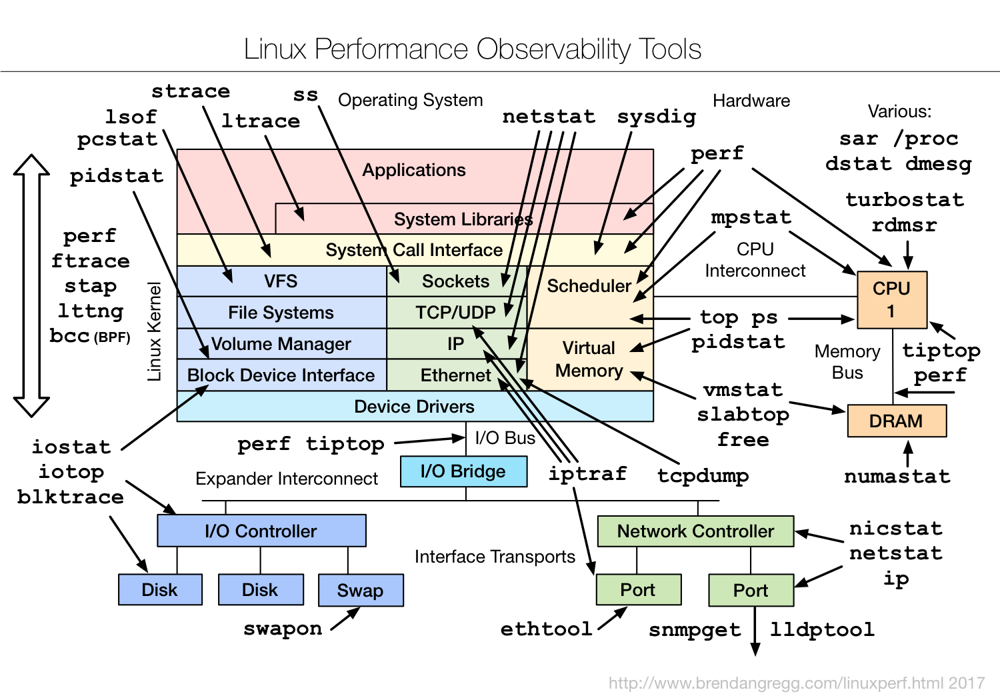

## netshoot: a Docker network trouble-shooting container
# CentOS Edition

**Thank you to [@nicolaka](https://github.com/nicolaka/) for the original**

### Please visit [https://github.com/nicolaka/netshoot](https://github.com/nicolaka/netshoot) for detailed instructions.

**Purpose:** Docker network tshooting can be difficult for network engineers. With proper understanding of how Docker networking works and the right set of tools, you can troubleshoot and resolve these networking issues. The `netshoot` container has a set of powerful networking tshooting tools that can be used to troubleshoot Docker networking issues. 

To troubleshoot these issues, `netshoot` includes a set of powerful tools as recommended by this diagram. 

**Included Packages:** The following packages are included in `netshoot`. We'll go over some with some sample use-cases.

  * iperf3 
  * tcpdump 	
  * net-tools(netstat)
  * iproute
  * util-linux(nsenter) 
  * bridge-utils 
  * bind-utils
  * httpd-tools
  * iputils 
  * curl
  * ethtool
  * nmap
  * ipvsadm
  * conntrack-tools
  * socat

**Network Namespaces:** Network namespaces provide isolation of the system resources associated with networking. Docker uses network and other type of namespaces (`pid`,`mount`,`user`..etc) to create an isolated environment for each container. Everything from interfaces, routes, and IPs is completely isolated within the network namespace of the container. 

Cool thing about namespaces is that you can switch between them. You can enter a different container's network namespace, perform some troubleshooting on its network's stack with tools that aren't even installed on that container. Additionally, `netshoot` can be used to troubleshoot the host itself by using the host's network namespace. This allows you to perform any troubleshooting without installing any new packages directly on the host or your application's package. 

* **Container's Network Namespace:** If you're having networking issues with your application's container, you can launch `netshoot` with that container's network namespace like this :

`$ docker run -it --net container:<container_name> nicolaka/netshoot`

* **Host's Network Namespace:** If you think the networking issue is on the host itself, you can launch `netshoot` with that host's network namespace. This is how:
 
`$ docker run -it --net host nicolaka/netshoot`

* **Network's Network Namespace:** If you want to troubleshoot a Docker network, you can enter the network's namespace using `nsenter`. This is explained in the `nsenter` section below.

**Network Problems:** Many network issues could result in application performance degradations. Some of those issues could be related to the underlying networking infrastructure(underlay). Others could be related to misconfiguration at the host or Docker level. Let's take a look at common networking issues:

* latency
* routing 
* DNS resolution
* firewall 
* incomplete ARPs

### Please visit [https://github.com/nicolaka/netshoot](https://github.com/nicolaka/netshoot) for detailed instructions.
